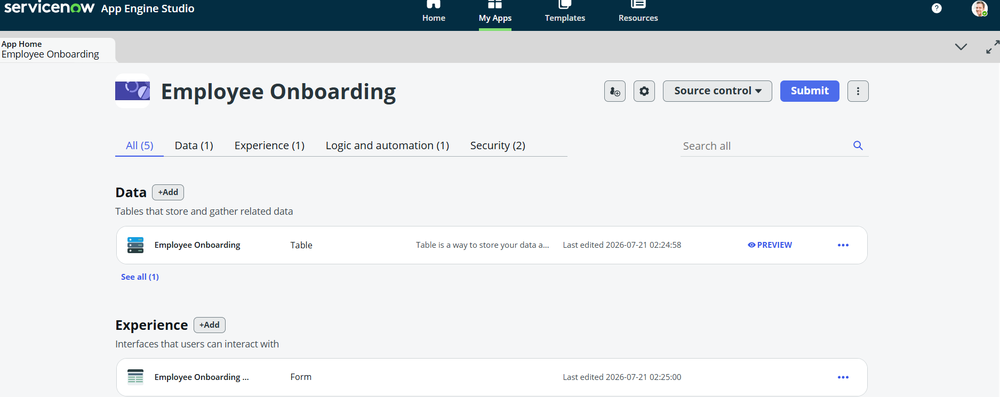
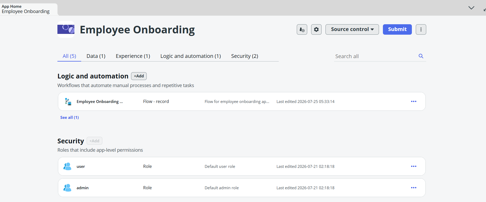
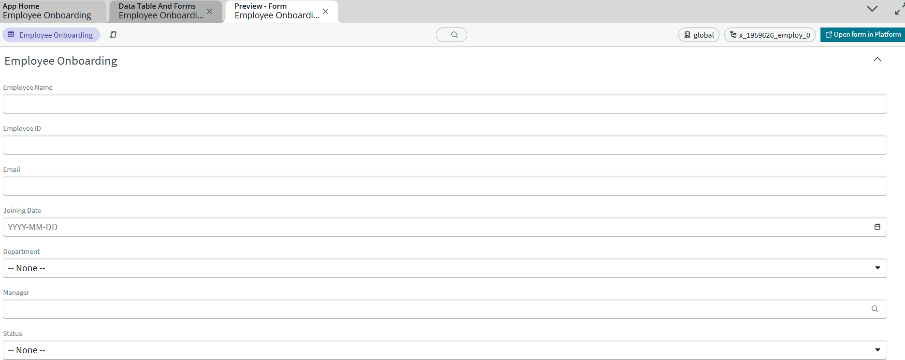
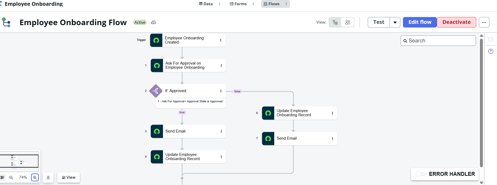
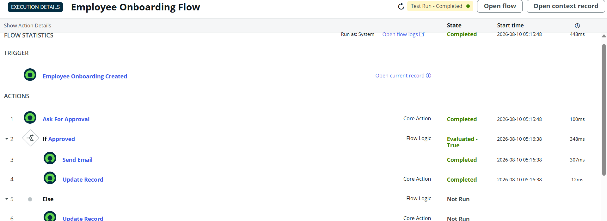
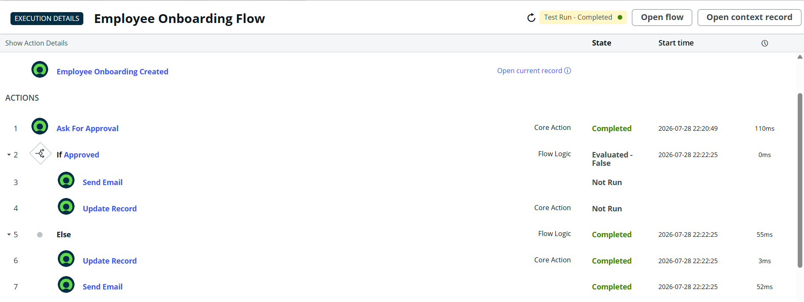
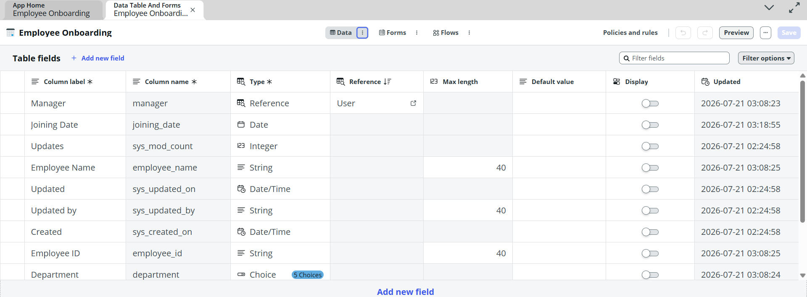
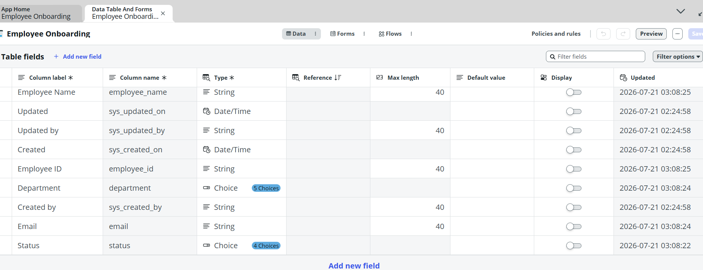

# Employee Onboarding System - ServiceNow

## Project Overview

The Employee Onboarding System is a ServiceNow-based application designed to simplify and automate the employee onboarding process.

It helps organizations manage employee details, onboarding requests, tasks, and workflow activities in a centralized system.

## Features

- Employee onboarding request creation
- Employee details management
- Onboarding forms
- Automated workflow
- Task management
- Status tracking
- Employee data management
- Records management
- Reports and dashboards

## Technologies Used

- ServiceNow
- ServiceNow Application Development
- Tables
- Forms
- Business Rules
- Client Scripts
- Flow Designer
- Reports and Dashboards

## Project Workflow

Employee Details
        ↓
Onboarding Request
        ↓
Validation
        ↓
Onboarding Tasks
        ↓
Task Completion
        ↓
Onboarding Completed

## Screenshots

### Employee Onboarding

### Employee Details

### Onboarding Form

### Workflow Logic

### Output

### Output 2

### Employee Data

### Employee Records

### Employee Information

## Objective

The main objective of this project is to automate and simplify the employee onboarding process using ServiceNow.

## Future Enhancements

- Automated email notifications
- Role-based access control
- Advanced dashboards
- HR system integration
- Automated document generation

## Author

Yenimireddy Vignesh